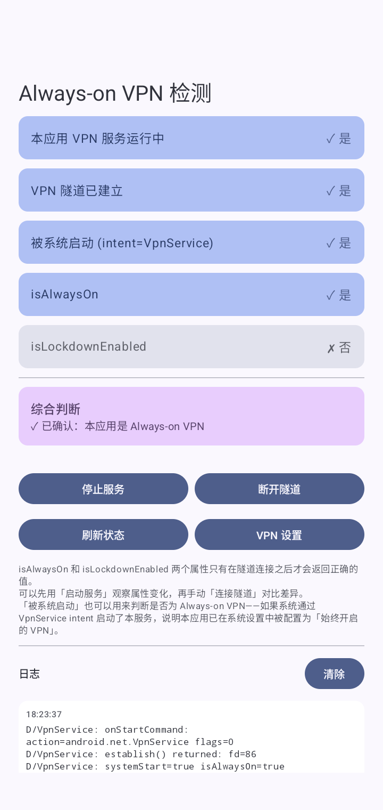

# AlwaysOnTest

A diagnostic tool for exploring how Android's `VpnService.isAlwaysOn` and `VpnService.isLockdownEnabled` APIs behave under different conditions.

## Screenshot


## Purpose

Android provides `isAlwaysOn` and `isLockdownEnabled` on `VpnService` to let VPN apps detect whether they have been designated as the system's Always-on VPN. However, these APIs have non-obvious requirements:

- **They only return correct values after a VPN tunnel is established** via `VpnService.Builder.establish()`. Before that, both always return `false`.
- After `establish()`, there may be a brief delay before the values are updated—manual refresh may be needed.
- "Started by System" can also be used to determine Always-on status — if the system starts this service with the VpnService `intent.action = VpnService.SERVICE_INTERFACE`, it means the app is configured as Always-on VPN in system settings.

This app provides a UI to experiment with these behaviors interactively.

## Build

```bash
./gradlew :app:assembleDebug
```

Requires Android SDK with compileSdk 36. Min SDK is 34 (Android 14+).

## Tech Stack

- Kotlin 2.0.21
- Jetpack Compose with Material 3
- AGP 9.0.0
- `VpnService` with actual tunnel (routes only own app traffic via `addAllowedApplication`)

## License

MIT-0

## Credits

This app was written by Claude Opus 4.6 (GitHub Copilot).

---

# AlwaysOnTest

探索 Android `VpnService.isAlwaysOn` 和 `VpnService.isLockdownEnabled` API 工作机制的诊断工具。

## 截图



## 用途

Android 在 `VpnService` 上提供了 `isAlwaysOn` 和 `isLockdownEnabled` 方法，让 VPN 应用检测自己是否被设为系统的「始终开启的 VPN」。但这些 API 有一些不容易发现的前提条件：

- **必须在 `VpnService.Builder.establish()` 建立隧道之后，返回值才是正确的**。在此之前两个值始终返回 `false`。
- `establish()` 之后可能有短暂延迟，需要手动刷新才能看到更新后的值。
- 「被系统启动」也可以用来判断是否为 Always-on VPN——如果系统通过 VpnService `intent.action = VpnService.SERVICE_INTERFACE` 启动了本服务，说明本应用已在系统设置中被配置为「始终开启的 VPN」。

本应用提供了一个可交互的界面，方便你实验和观察这些行为。

## 构建

```bash
./gradlew :app:assembleDebug
```

需要 Android SDK，compileSdk 36。最低 SDK 为 34（Android 14+）。

## 技术栈

- Kotlin 2.0.21
- Jetpack Compose + Material 3
- AGP 9.0.0
- 实际建立 VPN 隧道的 `VpnService`（通过 `addAllowedApplication` 仅路由本应用流量）

## 许可

MIT-0

## 致谢

本应用由 Claude Opus 4.6 (GitHub Copilot) 编写。
