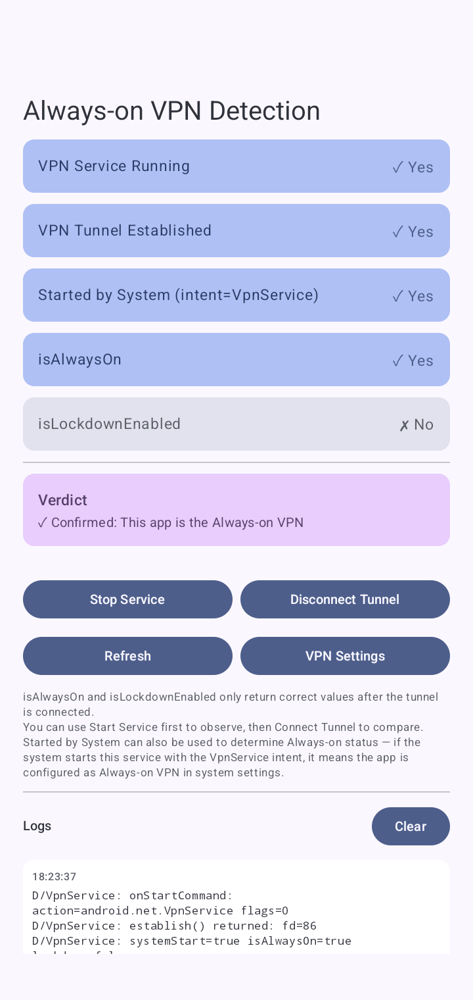

# AlwaysOnTest

| **\[English\]** | [中文](README_zh.md) |

A diagnostic tool for exploring how Android's `VpnService.isAlwaysOn` and `VpnService.isLockdownEnabled` APIs behave under different conditions.

## Screenshot



## Purpose

Android provides `isAlwaysOn` and `isLockdownEnabled` on `VpnService` to let VPN apps detect whether they have been designated as the system's Always-on VPN. However, these APIs have non-obvious requirements:

- **They only return correct values after a VPN tunnel is established** via `VpnService.Builder.establish()`. Before that, both always return `false`.
- After `establish()`, there may be a brief delay before the values are updated—manual refresh may be needed.
- "Started by System" can also be used to determine Always-on status — if the system starts this service with the VpnService `intent.action = VpnService.SERVICE_INTERFACE`, it means the app is configured as Always-on VPN in system settings.

This app provides a UI to experiment with these behaviors interactively.

## Build

```bash
./gradlew :app:assembleDebug
```

Requires Android SDK with compileSdk 36. Min SDK is 34 (Android 14+).

## Tech Stack

- Kotlin 2.0.21
- Jetpack Compose with Material 3
- AGP 9.0.0
- `VpnService` with actual tunnel (routes only own app traffic via `addAllowedApplication`)

## License

MIT-0

## Credits

This app was written by Claude Opus 4.6 (GitHub Copilot).